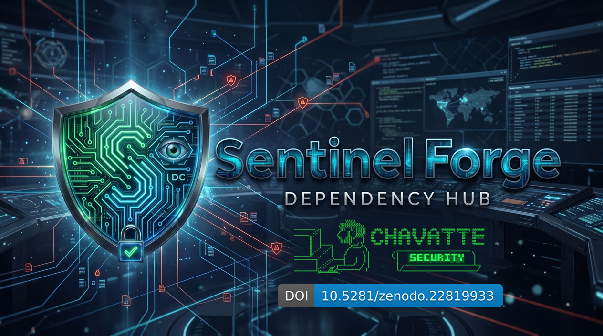
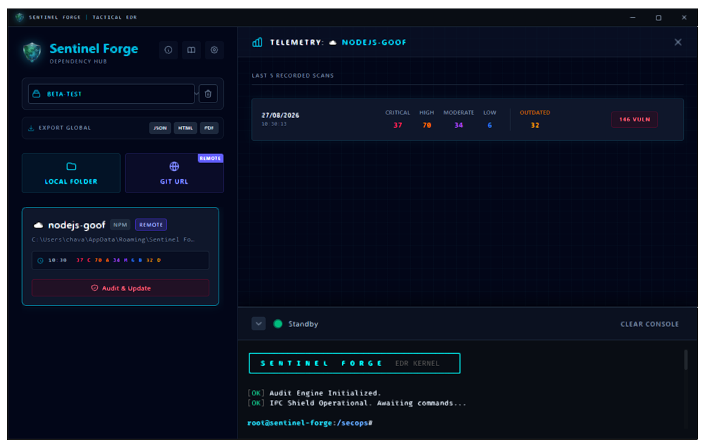
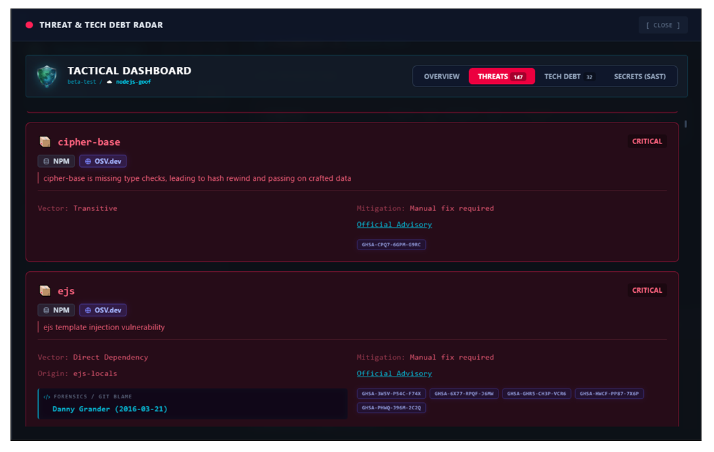
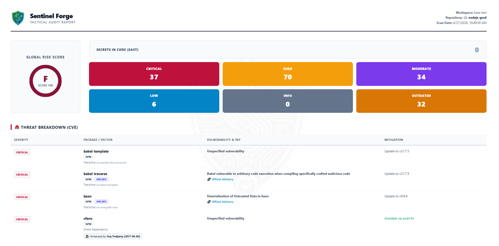

<pre style="font-size: 0.5rem;">

                              \\\\\\
                           \\\\\\\\\\\\
                          \\\\\\\\\\\\\\\
-------------,-|           |C>   // )\\\\|    .o88b. db   db  .d8b.  db    db  .d8b.  d888888b d888888b d88888b
           ,','|          /    || ,'/////|   d8P  Y8 88   88 d8' '8b 88    88 d8' '8b '~~88~~' '~~88~~' 88'  
---------,','  |         (,    ||   /////    8P      88ooo88 88ooo88 Y8    8P 88ooo88    88       88    88ooooo 
         ||    |          \\  ||||//''''|    8b      88~~~88 88~~~88 '8b  d8' 88~~~88    88       88    88~~~~~ 
         ||    |           |||||||     _|    Y8b  d8 88   88 88   88  '8bd8'  88   88    88       88    88.   
         ||    |______      ''''\____/ \      'Y88P' YP   YP YP   YP    YP    YP   YP    YP       YP    Y88888P
         ||    |     ,|         _/_____/ \
         ||  ,'    ,' |        /          |                 ___________________________________________
         ||,'    ,'   |       |         \  |              / \                                           \ 
_________|/    ,'     |      /           | |             |  |                                            | 
_____________,'      ,',_____|      |    | |              \ |      chavatte@duck.com                     | 
             |     ,','      |      |    | |                |                       chavatte.vercel.app  | 
             |   ,','    ____|_____/    /  |                |    ________________________________________|___
             | ,','  __/ |             /   |                |  /                                            /
_____________|','   ///_/-------------/   |                 \_/____________________________________________/ 
              |===========,'                                                                                  
			  

</pre>

<div align="center">



# Sentinel Forge

### Tactical Incident Detection and Response for Developer Security

[](https://doi.org/10.5281/zenodo.22819933)
[](https://github.com/chavatte/sentinel-forge/releases)
[](https://www.electronjs.org/)
[](https://react.dev/)
[](https://vite.dev/)
[](https://www.typescriptlang.org/)
[](https://yarnpkg.com/)
[](./LICENSE)

**Languages:** 🇺🇸 **English** · 🇧🇷 [Português](README.pt-BR.md) · 🇪🇸 [Español](README.es.md) · 🇩🇪 [Deutsch](README.de.md) · 🇷🇺 [Русский](README.ru.md) · 🇨🇳 [简体中文](README.zh-CN.md)

**Detect. Investigate. Remediate.**

Sentinel Forge is a security-focused desktop application that brings together software supply-chain auditing, secret detection, repository forensics, risk scoring, SBOM generation, and Git-based remediation in a single local SOC-style interface.

[Capabilities](#-capabilities) • [Architecture](#-architecture) • [Security](#-security-model) • [Installation](#-getting-started) • [Build](#-build-and-distribution) • [Documentation](#-integrated-documentation)



</div>

---

## Overview

Modern applications inherit a large attack surface from their source code, dependencies, credentials, CI/CD pipelines, and development tooling. Sentinel Forge was designed to make this surface visible and actionable directly from the developer workstation.

The application combines security analysis with operational workflows instead of treating scanning as a simple report:

```
┌──────────────────────────────────────────────────────────────┐
│                      SENTINEL FORGE                          │
├──────────────────────────────────────────────────────────────┤
│  Repository                                                  │
│     │                                                        │
│     ├── Dependency Audit ─────────► CVEs / GHSAs / Outdated  │
│     ├── SAST / Secrets ───────────► Credential Findings      │
│     ├── Git Forensics ─────────────► Commit / Author / Blame │
│     ├── Risk Engine ───────────────► 0–100 / A–F             │
│     └── SBOM Generator ────────────► CycloneDX               │
│                                                              │
│  Optional Git-OPS Remediation ─────► Patch → Commit → Push   │
└──────────────────────────────────────────────────────────────┘
```

Sentinel Forge is built with Electron, React, TypeScript, and Vite, with a security-oriented Electron main process coordinating local analysis engines and the renderer interface.

---

## ✨ Capabilities

### Supply Chain Security

Sentinel Forge audits JavaScript package ecosystems across **npm, Yarn, PNPM, and Bun** workflows. Dependency findings can be correlated with OSV.dev vulnerability intelligence, while outdated packages are presented as technical-debt signals.

- Direct and transitive dependency analysis
    
- CVE / GHSA-oriented vulnerability visibility
    
- Outdated dependency detection
    
- Yarn Berry-compatible parsing
    
- JSON audit parsing and fallback mechanisms
    
- Correlation between dependency findings and repository history
    

### 🔐 SAST and Secret Detection

The local SAST engine looks for potentially exposed credentials and other high-risk patterns in repositories.

- AWS and cloud credential patterns
    
- GitHub tokens
    
- Private SSH keys
    
- Stripe-format secrets
    
- Custom regular-expression rules
    
- Local scanning without requiring an external analysis service
    

> Custom rules allow the scanner to adapt to internal API tokens, proprietary credential formats, and organization-specific indicators.

### 🕵️ Repository Forensics

Security findings become more useful when their origin can be identified.

Sentinel Forge integrates Git history analysis to connect vulnerable dependency findings with repository context, including the commit and author associated with the introduction of a dependency.

<div align="center">  </div>

### ⚙️ Git-OPS and Remediation

The Git-OPS workflow is designed for controlled, automated remediation of dependency findings.

Typical flow:

```
Finding
  ↓
Analyze affected dependency
  ↓
Apply security update
  ↓
Resolve / update lockfile
  ↓
Prepare expected manifests
  ↓
Create application-attributed / signed commit
  ↓
Push remediation to origin
```

The goal is to reduce the distance between **finding a supply-chain problem** and **producing a traceable remediation change**.

### 📊 Risk Scoring and Reports

Technical findings are consolidated into an application-level risk view.

- Numerical risk score from **0–100**
    
- Letter classification from **A to F**
    
- Vulnerabilities and secrets incorporated into security posture
    
- Interactive HTML reports
    
- PDF report generation
    
- Raw JSON export for external processing
    
- CycloneDX SBOM generation
    

<div align="center">  </div>

### 👁️ EDR Watcher

The watcher provides background monitoring for mapped workspaces and can generate native desktop notifications when relevant security conditions are detected during normal development activity.

This feature is intended as a lightweight developer-side detection layer, not as a replacement for enterprise endpoint telemetry platforms.

### 🖥️ Integrated Terminal

Sentinel Forge includes an integrated terminal/log surface based on **xterm.js**, allowing security and maintenance operations to be observed directly within the application.

ANSI color rendering is explicitly configured for both development and packaged Electron environments.

---

## 🏗️ Architecture

Sentinel Forge follows a separated Electron architecture designed to keep privileged operations outside the renderer.

```
                    ┌──────────────────────────┐
                    │        React UI          │
                    │     Renderer Process     │
                    └────────────┬─────────────┘
                                 │
                           Secure IPC / Preload
                                 │
                    ┌────────────▼─────────────┐
                    │      Electron Main       │
                    │   Privileged Kernel      │
                    └────────────┬─────────────┘
                                 │
           ┌──────────────────────┼──────────────────────┐
           │                      │                      │
           ▼                      ▼                      ▼
    Dependency Audit        SAST / Secrets        Git Operations
           │                      │                      │
           ▼                      ▼                      ▼
        OSV.dev              Local Source         Git Repository
           │
           └──────────────────────┬──────────────────────┘
                                  ▼
                         Risk / Reports / SBOM
```

### Main layers

|Layer|Responsibility|
|---|---|
|**React Renderer**|Dashboard, workspace management, settings, findings, and report UI|
|**Preload / IPC**|Restricted bridge between renderer and privileged Electron APIs|
|**Electron Main**|Lifecycle, windows, tray, security policies, and orchestration|
|**Security Engines**|Auditing, OSV queries, SAST, Git blame, SBOM, and watcher|
|**Reporting**|HTML, PDF, and JSON exports|
|**Updater**|Production update checks via `electron-updater`|

The renderer does not receive unrestricted Node.js access. Privileged operations remain in the Electron main process and are exposed through controlled preload APIs.

---

## 🔒 Security Model

Security is an architectural constraint in Sentinel Forge, not merely a feature exposed through the interface.

### Electron Hardening

The application uses Electron security controls including:

- `contextIsolation: true`
    
- `nodeIntegration: false`
    
- `sandbox: true`
    
- Permission request restrictions
    
- `BrowserWindow` navigation control
    
- Production Content Security Policy
    
- Local IPC boundaries through preload scripts
    

### Command Execution

Repository tools run in the Electron main process. The application uses explicit command construction and validation instead of exposing a generic shell API to the renderer.

### Production CSP

The packaged application uses a production Content Security Policy. Because xterm.js creates renderer styles at runtime, trusted inline styles are explicitly allowed by the policy, while remote script execution remains restricted.

### Local-first Analysis

Local SAST and repository analysis can run without sending source code to an external scanning service. Network access is used when external intelligence or remote Git operations are required, such as vulnerability queries to OSV.dev or remote Git workflows.

---

## 📖 Integrated Documentation

Sentinel Forge includes an embedded **Help Center**, rather than requiring users to rely exclusively on an external website.

The documentation covers areas such as:

- Application usage flow
    
- Workspace management
    
- Security analysis
    
- Maintenance operations
    
- Risk scoring methodology
    
- Git-OPS workflows
    
- Operational commands
    

The help center is packaged with the application and follows the same localization strategy as the main interface.

---

## 🌍 Localization

The application currently includes localization resources for:

- 🇺🇸 English
    
- 🇧🇷 Brazilian Portuguese
    
- 🇪🇸 Spanish
    
- 🇩🇪 German
    
- 🇷🇺 Russian
    
- 🇨🇳 Simplified Chinese
    

Language switching is propagated throughout the application and tray interface without requiring a full restart.

---

## 🧰 Technology Stack

|Technology|Role|
|---|---|
|**Electron 43**|Cross-platform desktop runtime|
|**React 19**|Renderer UI|
|**TypeScript 7**|Application language|
|**Vite 8**|Frontend build and Electron integration|
|**Yarn 4 (Berry)**|Package manager|
|**xterm.js**|Integrated terminal/log rendering|
|**Chokidar**|File-system monitoring|
|**i18next / react-i18next**|Localization|
|**electron-builder**|Desktop packaging|
|**electron-updater**|Production update mechanism|

---

## 🚀 Getting Started

### Requirements

- **Node.js 22+**
    
- **Yarn 4** via Corepack
    
- Git
    
- A supported package manager for auditing target repositories: npm, Yarn, PNPM, or Bun
    

### Clone

```
git clone https://github.com/chavatte/sentinel-forge.git
cd sentinel-forge
```

### Enable Corepack

```
corepack enable
```

### Install dependencies

```
yarn install --immutable
```

### Start development mode

```
yarn dev
```

The Vite development server starts the renderer while Electron is launched through the Vite/Electron integration configured in the project.

---

## 📦 Build and Distribution

Create a production build with:

```
yarn build
```

The pipeline runs TypeScript compilation, Vite bundling, and Electron packaging.

### Platform targets

The current Electron Builder configuration targets:

|Platform|Artifacts|
|---|---|
|**Windows**|NSIS installer (`.exe`)|
|**Linux**|AppImage and `.deb`|
|**macOS**|`.dmg` and `.zip` for Intel / Apple Silicon|

The project uses GitHub Releases as its publication backend through `electron-builder` and `electron-updater`.

### Release flow

A version tag matching `v*` triggers the repository release workflow. GitHub Actions builds the application on Windows, Ubuntu, and macOS using Node.js 22 and Yarn 4.

Example:

```
git tag v1.0.8
git push origin v1.0.8
```

> Release signing depends on the signing configuration available in the build environment. The repository workflow currently disables automatic certificate discovery for CI builds.

---

## 📁 Project Structure

```
sentinel-forge/
├── electron/
│   ├── ipc/                 # Security and system IPC handlers
│   ├── preload/             # IPC bridges exposed to the renderer
│   ├── main.ts              # Electron entry point
│   ├── preload.ts           # Preload entry point
│   ├── tray.ts              # System tray and documentation window
│   ├── updater.ts            # Application updater
│   └── logger.ts             # Application logs
│
├── src/
│   ├── components/          # React components
│   ├── hooks/               # Application hooks
│   ├── locales/             # Translation resources
│   ├── utils/                # Risk, reporting, and helpers
│   ├── App.tsx              # Application shell
│   └── main.tsx             # React entry point
│
├── public/
│   ├── help.html             # Offline documentation entry point
│   └── help/                 # Documentation assets and scripts
│
├── docs/assets/              # README / project images
├── .github/workflows/        # Release automation
├── electron-builder.json5    # Packaging configuration
├── vite.config.ts            # Vite + Electron configuration
└── package.json
```

---

## 🧪 Development Notes

Sentinel Forge is an actively developed security-engineering project. Features may evolve as analysis engines, remediation workflows, and the desktop security model mature.

When extending the project, keep the following boundaries:

1. Keep privileged operations in the Electron main process.
    
2. Expose only narrowly scoped operations through preload IPC.
    
3. Validate inputs before filesystem, Git, or process-execution operations.
    
4. Preserve the production CSP and Electron hardening settings.
    
5. Prefer deterministic parsers and structured output in security tools.
    
6. Keep user-visible findings explainable and traceable to their origin.
    

---

## ⚠️ Security and Operational Considerations

Sentinel Forge is a defensive security tool. Running automated remediation or repository commands may modify working trees and remote repositories.

Use Git branches, backups, and appropriate repository permissions when testing Git-OPS features.

Connectivity to OSV.dev is required for real-time external vulnerability intelligence. Local repository scanning remains available for analyses that do not require external services.

---

## 📚 Documentation and Resources

- **Integrated Help Center:** embedded in the desktop application
    
- **GitHub Repository:** [https://github.com/chavatte/sentinel-forge](https://github.com/chavatte/sentinel-forge)
    
- **OSV.dev:** [https://osv.dev/](https://osv.dev/)
    
- **CycloneDX:** [https://cyclonedx.org/](https://cyclonedx.org/)
    
- **Electron:** [https://www.electronjs.org/](https://www.electronjs.org/)
    

---

## 🗺️ Roadmap Direction

The project is evolving toward a broader developer-security platform, with emphasis on:

- richer supply-chain intelligence
    
- more advanced repository forensics
    
- expanded SAST coverage
    
- safer automated remediation
    
- deeper EDR-style workspace telemetry
    
- improved compliance reports and workflows
    
- additional developer-centric security integrations
    

---

## 🤝 Contributing

Contributions, bug reports, and security-focused feedback are welcome.

For changes that affect security-sensitive behavior, include:

- the threat or use case being addressed
    
- the affected security boundary
    
- reproducible steps or test evidence
    
- any impact on packaged Electron builds
    

---

## 📜 License

Sentinel Forge is distributed under the **MIT License**.

Copyright © 2026 **DevChavatte**.

See [LICENSE](./LICENSE) for the full license text.

---

<div align="center">

**Sentinel Forge — Developer Security, Supply Chain Intelligence, and Tactical EDR.**

Built and maintained by [**DevChavatte**](https://github.com/chavatte).

</div>
